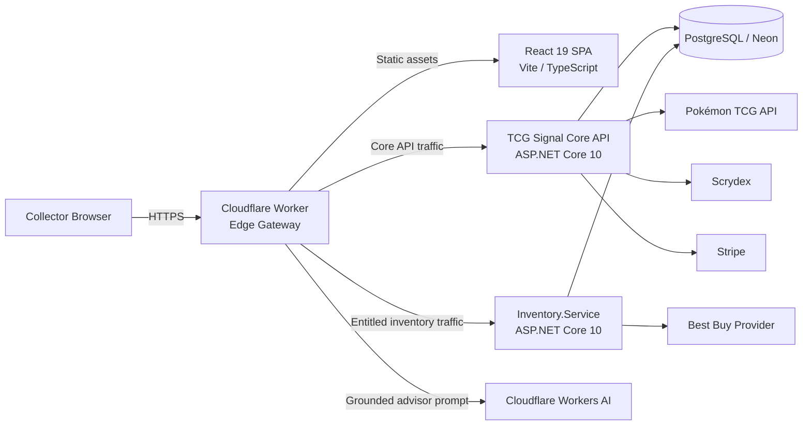
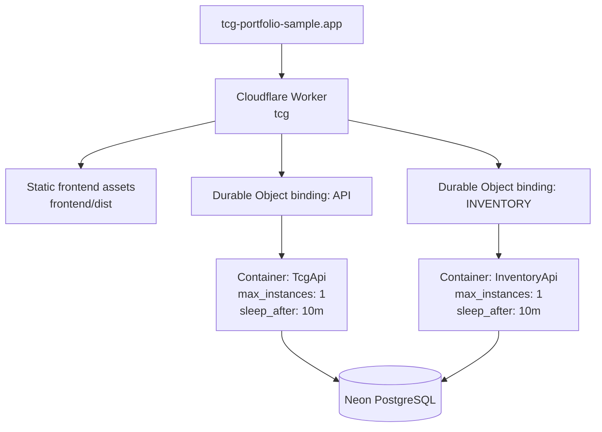
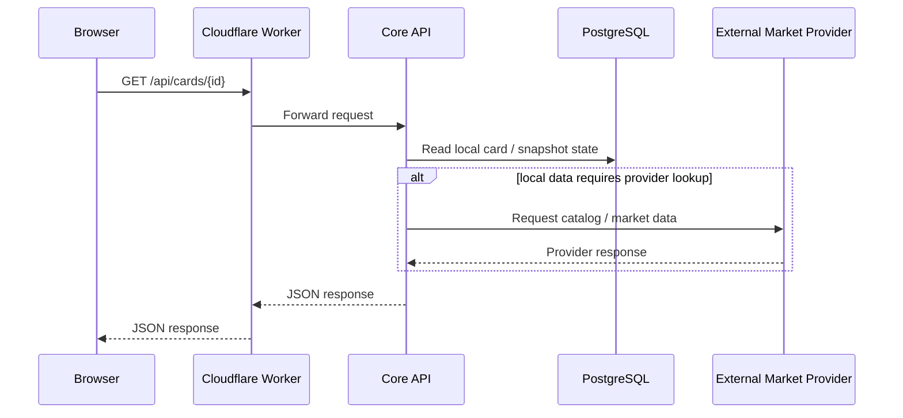
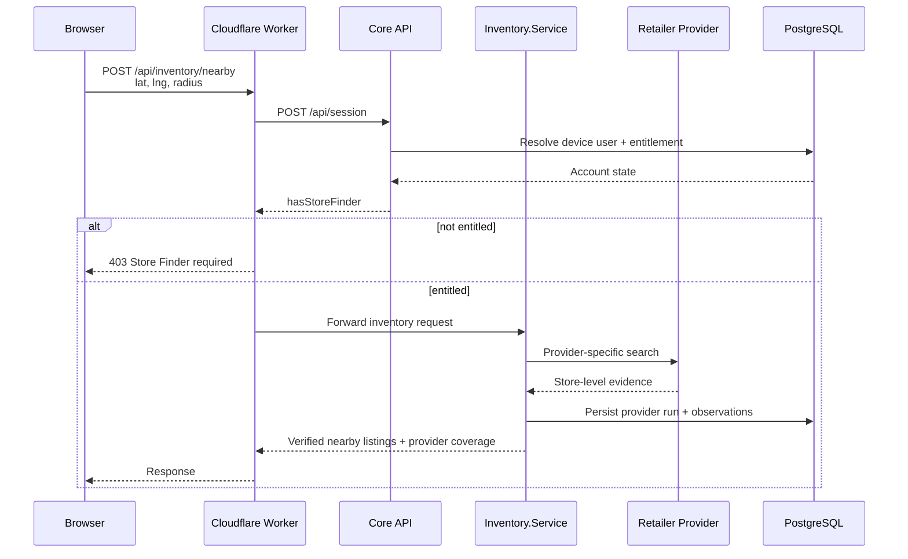

# TCG Signal

[](https://github.com/poker-kid-100717/tcg/actions/workflows/ci.yml)

**Production:** https://tcg-portfolio-sample.app

TCG Signal is a cloud-hosted Pokémon TCG market-intelligence and collector platform. The application combines a React client, a .NET 10 core API, an independently deployable inventory service, PostgreSQL persistence, Cloudflare edge routing, scheduled price collection, model validation, optional billing, and optional AI-assisted collection guidance.

This README is the architectural source of truth for the repository. It describes the runtime boundaries, data ownership, request flows, operational model, security controls, design tradeoffs, and known scaling limits.

---

## 1. Architecture goals

The design is intentionally optimized around five principles.

1. **Trustworthy data over broad claims.**  
   Missing, stale, or unverified information is represented explicitly instead of being inferred.

2. **Separate workloads that fail differently.**  
   Retail inventory is isolated from pricing and collector workflows because retailer APIs, release-day traffic, and stock volatility have different operational characteristics.

3. **Keep the edge thin but useful.**  
   Cloudflare terminates TLS, serves the SPA, enforces selected entitlements, routes traffic, runs scheduled jobs, and hosts the AI orchestration boundary. Domain logic remains in the .NET services.

4. **Persist state outside containers.**  
   Both application containers are disposable. PostgreSQL owns durable state.

5. **Make model output earn the right to be shown.**  
   Forecasts are published only when the trained model beats a no-change baseline on held-out data.

---

## 2. System context



### Runtime responsibility summary

| Boundary | Responsibility | Explicitly does not own |
|---|---|---|
| React SPA | User experience, client routing, query state, presentation | Secrets, authorization decisions, persistence |
| Cloudflare Worker | TLS edge, static assets, API routing, Store Finder entitlement gate, Workers AI orchestration, cron dispatch | Core business rules, durable application state |
| Core API | Pricing, market intelligence, sessions, subscriptions, watchlists, alerts, master sets, predictions | Retail inventory provider behavior |
| Inventory.Service | Retailer adapters, evidence rules, distance filtering, provider health, short-lived observations | User identity, billing state, market pricing |
| PostgreSQL | Durable application state | Compute |
| External providers | Catalog, market enrichment, billing, retailer inventory | TCG Signal authorization or product policy |

---

## 3. Deployment topology

Production is a single Cloudflare Worker with two Cloudflare Container applications behind it.



### Current scaling posture

This is an MVP/early-product topology, not a claim of unlimited scale.

- Core API is configured with one container instance.
- Inventory API is configured with one container instance.
- Containers sleep after inactivity and cold-start on demand.
- Static assets are served at the Cloudflare edge.
- Durable Object names provide stable routing to the container applications.
- PostgreSQL is the shared durable dependency.
- Inventory is a separate service boundary so it can scale independently later without rewriting the core product.

A future high-volume deployment can increase inventory capacity, separate databases, and introduce provider-specific queues without changing the public client contract.

---

## 4. Request routing and trust boundaries

The Worker is the only public ingress for production API traffic.

### Public routing policy

The Worker forwards:

- `/api/*`
- `/health`
- `/health/*`

It does **not** expose `/internal/*`.

All non-API requests are served from the React SPA asset binding.

### Forwarded headers

Cloudflare terminates HTTPS. The Worker forwards:

- `X-Forwarded-Proto`
- `X-Forwarded-For` when Cloudflare provides a client IP

The .NET Core API trusts these headers because the container is not directly exposed as a public internet endpoint.

---

## 5. Core request flows

### 5.1 Standard market-data request



### 5.2 Store Finder request

Inventory is authorization-gated before precise coordinates are forwarded to the inventory service.



**Privacy invariant:** user latitude and longitude are not persisted. Inventory.Service stores public store coordinates and retailer observations only.

### 5.3 Master Set AI Advisor

The AI boundary is deliberately grounded.

1. Browser requests `POST /api/master-sets/{id}/advisor`.
2. Worker requests server-generated advisor context from the Core API.
3. Core API returns only user-scoped collection and market facts.
4. Worker sends that structured context to Cloudflare Workers AI.
5. If inference is unavailable or fails, the Worker returns a deterministic Core-generated recommendation.

The model is not trusted to invent prices, sales, scarcity, inventory, or user holdings.

---

## 6. Service boundaries

### 6.1 Frontend

**Path:** `frontend/`

**Technology**

- React 19
- TypeScript
- Vite
- React Router
- TanStack Query
- Tailwind CSS
- Chart.js
- Vitest / Testing Library

**Responsibilities**

- Route-level application shell
- Card/set discovery
- Market views
- Watchlist and alert UX
- Deal Analyzer
- Master Set workflows
- Store Finder UX
- Subscription presentation
- Client-side geolocation acquisition
- Query caching and loading/error states

**Design rule:** the frontend never receives provider credentials, Stripe secrets, database credentials, or authorization authority.

---

### 6.2 Core API

**Path:** `backend/`

**Technology**

- ASP.NET Core 10 minimal APIs
- EF Core 10
- Npgsql
- HybridCache
- Microsoft.Extensions.Http.Resilience
- ML.NET / FastTree

The Core API owns the application domains that share collector identity and market state.

#### Pricing domain

**Path:** `backend/Pricing/`

Responsibilities include:

- Set/card catalog access
- Current pricing
- Local daily price snapshots
- Historical card pricing
- Movers
- Downtrend signals
- Supply-gap / sleeper signals
- Provider abstraction around Pokémon TCG API
- Prediction training and publication

Key components:

- `PokemonTcgClient`
- `PriceGuideService`
- `PriceSnapshotService`
- `PredictionService`

#### Product domain

**Path:** `backend/Product/`

Responsibilities include:

- Device session identity
- Backend entitlement calculation
- Stripe subscription state
- Watchlists
- Threshold alerts
- Dashboard data
- Market Intelligence
- Scrydex enrichment
- Master Set tracking
- AI advisor context generation

Key components:

- `SessionService`
- `EntitlementService`
- `StripeBillingService`
- `MarketIntelligenceService`
- `AlertEvaluationService`
- `MasterSetService`
- `ProductStore`
- `MasterSetStore`

---

### 6.3 Inventory.Service

**Path:** `inventory/`

Inventory is intentionally independent from the Core API.

Its workload differs in several ways:

- Inventory changes on a much shorter timescale than price history.
- Retailer APIs can degrade independently.
- Release-day traffic may spike abruptly.
- Provider-specific parsing and contracts change independently.
- False positives have immediate user cost: a wasted store trip.

#### Internal structure

```text
inventory/
├── Application/
│   ├── IInventoryProvider.cs
│   └── InventorySearchService.cs
├── Domain/
│   └── InventoryModels.cs
├── Infrastructure/
│   ├── InventoryStore.cs
│   └── PostgresConnectionString.cs
├── Providers/
│   └── BestBuy/
├── InventoryOptions.cs
└── Program.cs
```

#### Provider abstraction

Each retailer implements:

```csharp
public interface IInventoryProvider
{
    string Retailer { get; }
    bool IsConfigured { get; }

    Task<ProviderInventoryResult> SearchAsync(
        InventoryQuery query,
        CancellationToken cancellationToken);
}
```

This creates a clean anti-corruption layer between TCG Signal's inventory contract and retailer-specific APIs.

#### Accuracy contract

Inventory.Service follows a fail-closed policy:

- No store is marked in stock without store-specific provider evidence.
- Quantity is never invented.
- Provider failures produce degraded coverage, not stale stock claims.
- Unconfigured providers are identified explicitly.
- Low-stock state remains distinct from general availability.
- A failed adapter cannot take down the pricing API.

Current planned-but-withheld providers are Target, Walmart, and GameStop. They remain non-authoritative until a source meets the same evidence standard.

---

## 7. Persistence and data ownership

Production currently uses one PostgreSQL cluster, but ownership is separated logically by service.

### Core schema

Core schema evolution is managed through EF Core migrations in `backend/Migrations/`.

Primary areas include:

| Data | Owner | Access pattern |
|---|---|---|
| Cards / sets metadata | Core API | EF Core |
| Price snapshots | Core API | EF Core |
| Snapshot runs | Core API | EF Core |
| Prediction runs | Core API | EF Core |
| Price predictions | Core API | EF Core |
| Device users | Core Product domain | Direct Npgsql |
| Subscriptions | Core Product domain | Direct Npgsql |
| Watchlists | Core Product domain | Direct Npgsql |
| Alert events | Core Product domain | Direct Npgsql |
| Master sets | Core Product domain | Direct Npgsql |
| Master-set items | Core Product domain | Direct Npgsql |

The Product domain uses direct Npgsql for targeted SQL and user-scoped queries, while schema creation remains represented in Core EF migrations.

### Inventory schema

Inventory.Service owns:

- `inventory_observations`
- `inventory_provider_runs`

The service creates its inventory tables and indexes during startup.

Inventory observations are retained for a short operational window; current cleanup removes observations older than 72 hours.

### Database ownership rule

Sharing a PostgreSQL cluster does **not** imply shared write ownership.

- Core API writes Core/Product tables.
- Inventory.Service writes inventory tables.
- Cross-service writes are intentionally avoided.
- A future physical database split should not require changing the public API.

---

## 8. Scheduled data pipeline

Cloudflare Cron Triggers wake the Core API container.

| UTC | Job | Purpose |
|---|---|---|
| 11:15 | snapshots | Record current card/variant pricing |
| 11:45 | predictions | Train/validate model and refresh publishable predictions |

```mermaid
flowchart LR
    C1[11:15 UTC Cron] --> S[/internal/snapshots]
    S --> P[PriceSnapshotService]
    P --> DB[(PostgreSQL)]
    P --> A[Evaluate watchlist alerts]

    C2[11:45 UTC Cron] --> M[/internal/predictions]
    M --> T[PredictionService]
    T --> V{Beats no-change baseline?}
    V -->|Yes| PUB[Publish predictions]
    V -->|No| HOLD[Withhold model output]
    PUB --> DB
    HOLD --> DB
```

The `/internal/*` endpoints are callable only through the Worker scheduled handler and are not part of public routing.

---

## 9. Prediction architecture

The prediction system is intentionally conservative.

### Model

- ML.NET FastTree gradient-boosted regression
- Feature engineering across card, set, price history, ranking, trend, volatility, and premium features
- Time-separated training and validation
- 30-day forecast horizon by default

### Publication gate

A model run is published only when its validation MAE improves on a no-change baseline by the configured minimum.

Possible run states include:

- `Running`
- `Published`
- `Preview`
- `Withheld`
- `InsufficientHistory`
- `Skipped`
- `Failed`

### Why the gate exists

A price model that cannot outperform "the price stays the same" should not be presented as intelligence.

The application therefore separates:

- model execution,
- model validation,
- model publication,
- later realized performance scoring.

This makes model quality observable instead of treating every successful training run as product-worthy.

---

## 10. Market Intelligence

Market Intelligence combines local historical state with optional enrichment.

The service can expose:

- current market reference
- 7-day / 30-day change
- volatility
- freshness
- provenance
- confidence score and band
- deterministic explanation
- sold comps when an enrichment provider is configured
- liquidity state when supported by evidence

### Confidence philosophy

Confidence is deterministic and explainable. It is not an LLM-generated score.

Unknown provider data stays unknown. The application does not infer transaction volume or liquidity from unrelated fields.

---

## 11. External provider strategy

External integrations are treated as replaceable adapters rather than product-domain primitives.

### Pokémon TCG API

Current compatibility/catalog source for:

- cards
- sets
- images
- TCGplayer-linked price data
- snapshot ingestion

All access is isolated behind `PokemonTcgClient`.

### Scrydex

Optional market-enrichment provider used by Market Intelligence when configured.

The integration is designed so loss of Scrydex degrades enrichment rather than taking down core price history.

### Stripe

Optional billing provider.

The Core API owns subscription state and derives entitlements server-side. Frontend redirects do not grant access.

### Best Buy

Current implemented Inventory.Service provider adapter.

Inventory.Service consumes the provider through `IInventoryProvider`; retailer-specific behavior does not leak into the client contract.

---

## 12. Identity and authorization

The current identity model is intentionally lightweight.

### Device session

A first-party device session is created using:

- cryptographically random 256-bit token
- SHA-256 token hash persisted in PostgreSQL
- HttpOnly cookie
- Secure cookie over HTTPS
- SameSite=Lax
- 180-day expiration

The raw token is never stored in the database.

### Authorization

Collector-owned resources are scoped by resolved user ID.

Examples:

- watchlist mutations
- alert reads
- dashboard data
- master sets
- subscription state

### Entitlements

Core API calculates:

- Pro access
- Store Finder access
- current plan / status

The Worker calls the Core API before forwarding inventory coordinates.

### MVP limitation

Device-bound identity is not a substitute for production multi-device authentication.

The intended evolution is OIDC-based account identity with migration of the existing device profile into the authenticated account.

---

## 13. Billing behavior

Stripe is optional by design.

When required Stripe settings are present:

- Checkout creates a subscription flow.
- Webhooks update backend subscription state.
- Customer Portal manages subscription lifecycle.
- Entitlements are derived from backend state.

Recognized active subscription states include:

- `active`
- `trialing`

When Stripe is not configured, the application enters **Founding Preview** mode so product workflows remain testable without fake checkout state.

Store Finder and Pro are modeled as separate entitlements; a combined plan can grant both.

---

## 14. Reliability and failure handling

### Core API startup

Core database initialization runs in a background service.

- `/health/live` reports process liveness.
- `/health` reports readiness, including database state.
- API requests wait briefly for database initialization.
- If readiness is not achieved within the configured window, the API returns `503 Service Unavailable` rather than running against a partially initialized schema.

### External HTTP resilience

The Core and Inventory services use `Microsoft.Extensions.Http.Resilience` for provider calls.

Configured behavior includes bounded request timeouts and resilience handling so a slow provider does not indefinitely consume a request.

### Inventory failure semantics

Retailer errors are isolated per provider.

A provider exception results in:

- logged provider failure
- a provider-run record
- degraded coverage response
- zero fabricated listings

### Snapshot / prediction isolation

Predictions do not train against an incomplete current snapshot.

If the latest snapshot is still running or failed, the prediction run is skipped and the previous published predictions remain intact.

---

## 15. Observability

Current operational signals include:

- Cloudflare Worker observability
- Cloudflare Container logs
- ASP.NET structured logging
- `snapshot_runs`
- `prediction_runs`
- `inventory_provider_runs`
- readiness and liveness endpoints
- deployment smoke tests
- model validation metrics
- realized model checkpoints

### Health endpoints

| Endpoint | Meaning |
|---|---|
| `/health/live` | Process/container liveness |
| `/health` | Application readiness and database availability |

Production deployment does not complete successfully unless the smoke-test workflow verifies the live site and representative API endpoints.

---

## 16. Security model

### Secret handling

Secrets are injected at deployment time and never bundled into the frontend.

Required production secrets:

| Secret | Purpose |
|---|---|
| `CLOUDFLARE_API_TOKEN` | Worker/container deployment |
| `CLOUDFLARE_ACCOUNT_ID` | Cloudflare account targeting |
| `DATABASE_URL` | PostgreSQL connection |

Optional provider/billing secrets:

| Secret | Purpose |
|---|---|
| `POKEMONTCG_API_KEY` | Pokémon TCG provider credential |
| `SCRYDEX_API_KEY` | Scrydex credential |
| `SCRYDEX_TEAM_ID` | Scrydex team |
| `BESTBUY_API_KEY` | Inventory provider credential |
| `STRIPE_SECRET_KEY` | Stripe server credential |
| `STRIPE_WEBHOOK_SECRET` | Stripe webhook verification |
| `STRIPE_PRO_MONTHLY_PRICE_ID` | Pro monthly plan |
| `STRIPE_PRO_ANNUAL_PRICE_ID` | Pro annual plan |
| `STRIPE_STORE_FINDER_MONTHLY_PRICE_ID` | Store Finder plan |
| `STRIPE_COMPLETE_MONTHLY_PRICE_ID` | Combined plan |

### Security controls

- Provider credentials stay server-side.
- Stripe webhook signatures are verified server-side.
- Stripe redirects do not authorize access.
- Internal scheduled endpoints are not publicly routed.
- User-owned records are scoped by server-resolved user ID.
- Precise user geolocation is not persisted by Inventory.Service.
- Containers are disposable and do not own durable state.
- Provider failure never authorizes fabricated data.

### Known security follow-up

Before broad consumer launch:

- replace device identity with OIDC
- add explicit account recovery and multi-device semantics
- formalize rate limits
- add abuse controls for high-cost provider/AI endpoints
- rotate any credential that was ever committed to repository history

---

## 17. Data integrity invariants

These rules are product requirements, not presentation preferences.

- Never fabricate sold counts.
- Never fabricate liquidity.
- Never silently substitute one card variant for another.
- Preserve exact printing identity in watchlists and master sets.
- Keep source/provenance visible where it materially affects trust.
- Mark stale information as stale.
- Withhold ML predictions that fail validation.
- Do not claim a card will appreciate or sell at the displayed value.
- Do not mark a store in stock without store-specific evidence.
- Do not infer inventory quantity when the provider does not supply it.
- Treat provider failure as coverage degradation, not as cached truth.
- Do not persist user latitude/longitude in Inventory.Service.

---

## 18. Repository structure

```text
.
├── .github/workflows/
│   ├── ci.yml
│   └── deploy-cloudflare.yml
├── backend/
│   ├── Data/
│   ├── Migrations/
│   ├── Pricing/
│   │   └── Predictions/
│   ├── Product/
│   ├── Dockerfile
│   └── Program.cs
├── backend.Tests/
├── frontend/
│   └── src/
│       ├── api/
│       ├── components/
│       ├── lib/
│       └── pages/
├── inventory/
│   ├── Application/
│   ├── Domain/
│   ├── Infrastructure/
│   ├── Providers/
│   ├── Dockerfile
│   └── Program.cs
├── inventory.Tests/
├── worker/
│   └── index.ts
├── docker-compose.yml
├── PokemonTcgMarketplace.sln
└── wrangler.jsonc
```

---

## 19. API surface

Representative routes:

| Method | Route | Owner | Purpose |
|---|---|---|---|
| GET | `/api/sets` | Core | Set browser |
| GET | `/api/sets/{id}` | Core | Set detail |
| GET | `/api/cards/{id}` | Core | Card detail + price history |
| GET | `/api/cards?q=` | Core | Search |
| GET | `/api/cards/{id}/intelligence` | Core | Market Intelligence |
| GET | `/api/market/movers` | Core | Market movers |
| GET | `/api/market/downtrend` | Core | Downtrend signal |
| GET | `/api/market/sleepers` | Core | Supply-gap signal |
| GET | `/api/predictions` | Core | Published predictions |
| GET | `/api/predictions/model` | Core | Validation / model status |
| POST | `/api/session` | Core | Resolve/create device identity |
| GET/POST | `/api/watchlist` | Core | Watchlist workflows |
| GET | `/api/alerts` | Core | In-app alerts |
| GET | `/api/dashboard` | Core | Personalized dashboard |
| GET/POST | `/api/master-sets` | Core | Master-set workflows |
| POST | `/api/master-sets/{id}/advisor` | Edge + Core | Grounded AI advisor |
| POST | `/api/inventory/nearby` | Inventory | Entitled local inventory |
| POST | `/api/billing/checkout` | Core | Stripe Checkout |
| POST | `/api/billing/portal` | Core | Stripe Customer Portal |
| POST | `/api/billing/webhook` | Core | Signed Stripe events |
| GET | `/health` | Core | Readiness |
| GET | `/health/live` | Core | Liveness |

The route list is intentionally representative rather than a substitute for endpoint definitions in code.

---

## 20. CI/CD

### Continuous integration

`.github/workflows/ci.yml` runs three independent jobs.

#### Backend

- restore
- release build
- .NET tests
- EF Core pending-model-change check

#### Frontend

- install
- Vitest
- TypeScript/Vite production build

#### Worker

- install
- TypeScript typecheck
- Worker tests

### Production deployment

`.github/workflows/deploy-cloudflare.yml` runs on pushes to `main`.

Deployment sequence:

1. Install root and frontend dependencies.
2. Build frontend.
3. Deploy Worker and both container definitions through Wrangler.
4. Upload optional provider/billing secrets only when configured.
5. Smoke-test production:
   - readiness
   - SPA routes
   - set API
   - market status API

Deployment uses a concurrency group so a newer production deployment cancels an older in-flight deployment.

---

## 21. Local development

### Prerequisites

- .NET 10 SDK
- Node.js 22.12+
- Docker

### Start PostgreSQL

```bash
docker compose up -d
```

### Start Core API

```bash
dotnet run --project backend
```

### Start frontend

```bash
cd frontend
npm ci
npm run dev
```

### Run the full test suite

```bash
dotnet test PokemonTcgMarketplace.sln
cd frontend && npm test && npm run build
cd ..
npm test
npm run typecheck
```

### Record a local price snapshot

```bash
curl -X POST http://localhost:5259/internal/snapshots
```

### Optional Core configuration

Scrydex:

```text
Scrydex__ApiKey
Scrydex__TeamId
```

Stripe:

```text
Billing__StripeSecretKey
Billing__StripeWebhookSecret
Billing__ProMonthlyPriceId
Billing__ProAnnualPriceId
Billing__StoreFinderMonthlyPriceId
Billing__CompleteMonthlyPriceId
Billing__SiteUrl
```

Inventory:

```text
ConnectionStrings__DefaultConnection
Inventory__BestBuyApiKey
```

---

## 22. Architectural decisions and rationale

### ADR-001 — Cloudflare Worker as the public gateway

**Decision:** all production traffic enters through the Worker.

**Why**

- one public origin
- no browser CORS dependency
- centralized routing
- static assets at the edge
- scheduled job dispatch
- entitlement gate before forwarding precise inventory coordinates
- AI orchestration without giving the model database access

**Tradeoff**

The Worker becomes an important control plane and must remain intentionally small.

---

### ADR-002 — Inventory as a separate service

**Decision:** retailer inventory is isolated from market pricing.

**Why**

- different traffic profile
- different failure modes
- different freshness requirements
- provider churn
- independent future scaling
- false positives carry immediate user cost

**Tradeoff**

The MVP shares a PostgreSQL cluster, so runtime isolation is stronger than infrastructure isolation.

---

### ADR-003 — Shared database cluster, logical ownership

**Decision:** Core and Inventory share PostgreSQL initially but own separate tables.

**Why**

- lower MVP operational cost
- simpler deployment
- no distributed transaction requirement
- service contract already allows a future physical split

**Tradeoff**

Database-level blast radius remains shared until databases are physically separated.

---

### ADR-004 — Device identity before full OIDC

**Decision:** use a secure first-party device token for the MVP.

**Why**

- enables persisted user state immediately
- avoids custom password authentication
- supports billing-customer mapping
- keeps the surface area small

**Tradeoff**

No true multi-device identity, recovery, or account federation yet.

---

### ADR-005 — Fail closed on unverifiable inventory

**Decision:** an inventory provider failure returns no stock claim.

**Why**

The cost of a false positive is greater than the cost of an empty result.

**Tradeoff**

Coverage grows more slowly because a retailer is not added until its source meets the evidence standard.

---

### ADR-006 — Validate ML before publication

**Decision:** a trained model is not automatically a published model.

**Why**

Production ML needs a measurable baseline. If the model cannot beat no-change on held-out history, predictions are withheld.

**Tradeoff**

The Outlook can intentionally show no trained forecast during cold start or weak model periods.

---

## 23. Known constraints / technical debt

These are known architectural limitations rather than accidental omissions.

### Near term

- Pokémon TCG API remains a compatibility dependency and should continue moving behind replaceable provider contracts.
- Device identity needs OIDC before a broad multi-device launch.
- Inventory needs more validated retailer sources.
- Inventory database ownership is logical, not yet physically isolated.
- High-cost AI/provider routes need formal rate limiting before substantial public traffic.
- Email/push alert delivery is not yet part of the alert pipeline.
- Production dashboards/alerts should be added around provider degradation, cron failures, database readiness, and container cold-start latency.

### Medium term

- Split Inventory.Service persistence into its own database when workload or operational ownership justifies it.
- Add queued/asynchronous inventory polling if retailer count or release-day demand exceeds request-time fan-out.
- Add a verified local-card-store provider path so participating stores can publish inventory directly.
- Replace remaining direct provider assumptions with formal provider capability contracts.
- Add distributed tracing/correlation IDs across Worker → Core/Inventory → provider calls.
- Add explicit SLOs and alert thresholds once usage is large enough to make them meaningful.

---

## 24. Evolution path

The current architecture is designed to grow without forcing a rewrite.

A likely progression is:

```text
Current MVP
  |
  +-- OIDC identity
  +-- Local store inventory provider
  +-- Provider rate limits / caching
  +-- Inventory database separation
  +-- Queue-based retailer polling
  +-- Push/email notifications
  +-- Better operational telemetry
  |
  v
Multi-provider collector platform
```

The intended invariant is that the React client continues to consume stable TCG Signal contracts while provider, storage, and runtime implementations evolve behind those boundaries.

---

## 25. Engineering standard

For changes to this repository:

- Preserve service ownership boundaries.
- Prefer explicit unknown/degraded states over guessed data.
- Keep provider-specific behavior behind adapters.
- Do not expose secrets or internal routes to the browser.
- Add migrations for Core schema changes.
- Treat inventory schema as owned by Inventory.Service.
- Add tests for business rules, not only happy-path rendering.
- Keep deployment smoke tests representative of actual production dependencies.
- Document architectural changes that modify trust boundaries, data ownership, or service responsibilities.

---

TCG Signal is intentionally built as more than a card-price UI: the repository demonstrates a production-oriented separation of concerns across edge routing, service boundaries, persistence, provider isolation, billing, ML validation, and reliability behavior while remaining small enough to operate as an MVP.
